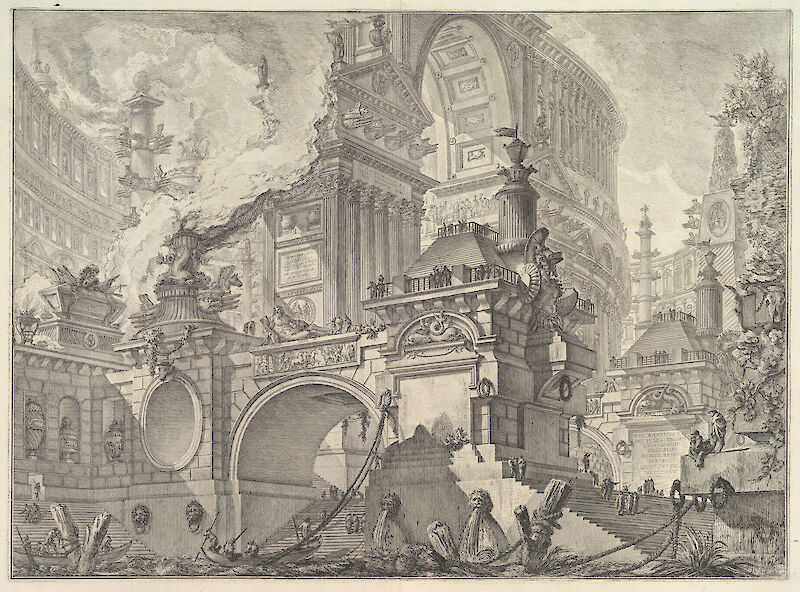

  <h1>[TheRealChrisMartin.com](https://therealchrismartin.com)</h1>
  
  

  My personal portfolio site.
  

  

  

    <i>
        Part of a spacious and magnificent Harbor for the use of the ancient Romans opening onto a large market square.
    </i>
  

  

    <b>Giovanni Battista Piranesi</b> (1761-1780)
  

## About the Project

This is the repository for my personal website, [TheRealChrisMartin.com](https://therealchrismartin.com)

### Tech Stack

### Attributions
[Piranesi](https://www.artandobject.com/articles/piranesis-visions-rome)
[LACMA](https://collections.lacma.org/node/171892)